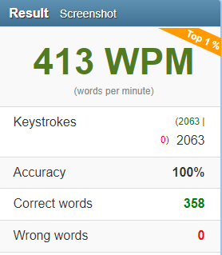

# Hacking [10FastFingers.com](https://10fastfingers.com/typing-test/english)

> Escreva mais rapido que qualquer outro humano.


Nesse repositorio você vai encontrar dois scripts que faz com que o computador escreva por você.

O app.py entra no 10FastFingers.com e começa a escrever pra você totalmente sozinho com uma media de 415wpm.

Já no manualapp.py escreve qualquer coisa pré colocada no script, é mais lento mas imita a digitação humana.

Esse scripts foram feitos com o intuito de aprender um pouco mais a respeito sobre Web Scraping e automação em Python.



--------------------------------------------------

### Esse script é apenas e exclusivamente para uso com fins educacionais


## Requisitos

[Python3.11 ou Superior](https://www.python.org/downloads/)

Selenium:

```sh
pip install selenium
```

Pyautogui:

```sh
pip install pyautogui
```

## Como usar?

Abra a pasta dos scripts e use o comando:
```sh
python app.py
```
